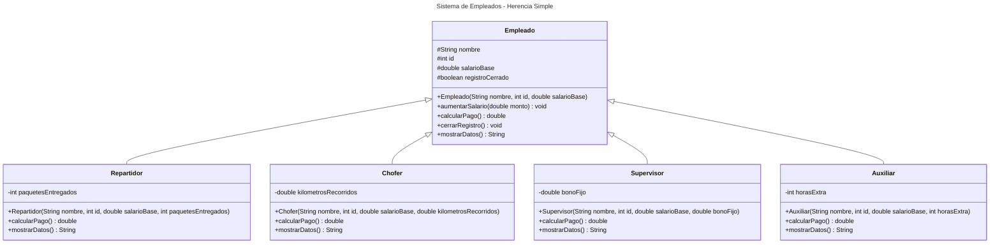

# Proyecto - Java con Pruebas para Autograding

Plantilla básica para proyecto de Java con Autograding

## Miniproyecto Unidad III - Herencia

### Enunciado

Desarrolla un sistema de empleados para una empresa de reparto usando herencia simple.

La clase base debe ser Empleado y las clases derivadas deben ser:
1. Repartidor
2. Chofer
3. Supervisor
4. Auxiliar


Requisitos funcionales:
1. Implementar constructor en cada clase derivada invocando super(...).
2. Reutilizar atributos y metodos heredados de Empleado.
3. Redefinir calcularPago() en cada clase derivada.
4. Redefinir mostrarDatos() en cada clase derivada.
5. Incluir un metodo cerrarRegistro() en la clase base para simular cierre de jornada.

Reglas de pago:
1. Repartidor: salarioBase + paquetesEntregados * 5
2. Chofer: salarioBase + kilometrosRecorridos * 2
3. Supervisor: salarioBase + bonoFijo
4. Auxiliar: salarioBase + horasExtra * 40

### Rubrica sugerida (100 puntos)
1. Herencia base-derivada correcta (3.1): 25
2. Reutilizacion de miembros heredados (3.3): 25
3. Uso correcto de super en constructores y metodos (3.4 y 3.5): 25
4. Redefinicion de metodos en derivadas (3.6): 25

### Criterios para AG (binario)
Cada criterio se evalua con una prueba JUnit de tipo pasa/no pasa.

1. `criterio1HerenciaBaseDerivada_25pts` -> 25 puntos
2. `criterio2ReutilizacionMiembrosHeredados_25pts` -> 25 puntos
3. `criterio3UsoDeSuperConstructoresYMetodos_25pts` -> 25 puntos
4. `criterio4RedefinicionDeMetodos_25pts` -> 25 puntos

Total: 100 puntos

Nota importante para ejecucion local:
1. Si ejecutas make clean, debes compilar antes de correr pruebas.
2. Flujo recomendado: make compile && make test

## Diagrama de clases
[Editor en línea](https://mermaid.live/)

[Referencia-Mermaid](https://mermaid.js.org/syntax/classDiagram.html)

## Diagrama de clases UML con draw.io
El repositorio está configurado para crear Diagramas de clases UML con ```draw.io```. Para usarlo simplemente agrega un archivo con extensión ```.drawio.png```, das doble clic sobre el mismo y se activará el editor ```draw.io``` incrustado en ```VSCode``` para edición. Asegúrate de agregar las formas UML en el menú de formas del lado izquierdo (opción ```+Más formas```).

## Uso del proyecto con make

### Default - Compilar+Probar+Ejecutar
```
make
```
### Compilar
```
make compile
```
### Probar todo
```
make test
```
### Ejecutar App
```
make run
```
### Limpiar binarios
```
make clean
```
## Comandos Git-Cambios y envío a Autograding

### Por cada cambio importante que haga, actualice su historia usando los comandos:
```
git add .
git commit -m "Descripción del cambio"
```
### Envíe sus actualizaciones a GitHub para Autograding con el comando:
```
git push origin main
```
## Comandos individuales
### Compilar

```
find ./ -type f -name "*.java" > compfiles.txt
javac -d build -cp lib/junit-platform-console-standalone-1.5.2.jar @compfiles.txt
```
Ejecutar ambos comandos en 1 sólo paso:

```
find ./ -type f -name "*.java" > compfiles.txt ; javac -d build -cp lib/junit-platform-console-standalone-1.5.2.jar @compfiles.txt
```


### Ejecutar todas las pruebas locales

```
java -jar lib/junit-platform-console-standalone-1.5.2.jar -class-path build --select-class miTest.AppTest
```
### Ejecutar una prueba local (un criterio AG)

```
java -jar lib/junit-platform-console-standalone-1.5.2.jar -class-path build --select-method miTest.AppTest#criterio1HerenciaBaseDerivada_25pts
```
### Ejecutar App
```
java -cp build miPrincipal.Principal
```
Los comandos anteriores están considerados para un ambiente Linux. [Referencia.](https://www.baeldung.com/junit-run-from-command-line)
